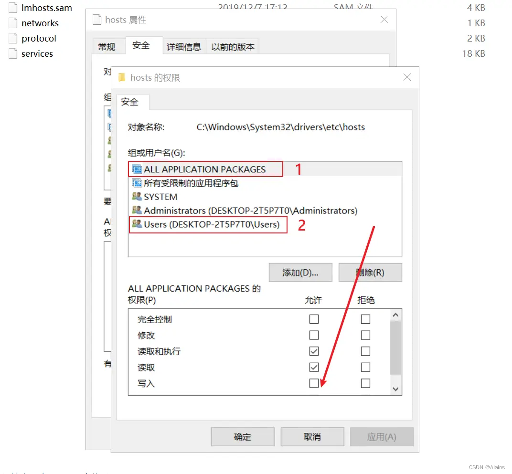

### cd作用
cd专门用于切换到具体的文件目录
### 相对路径
相同文件夹内：直接""内写文件名称
./:表示文件所在目录


### python 执行
**python** "./executename.py",注意文件路径必须明确才能够执行

### 使用Switchhosts来修改host
在 C:\Windows\System32\drivers\etc 文件夹中修改host文件的权限，

在上边的操作之后仍然是没有权限。。尝试把父包的权限也改掉，但是发现仍然不行。
在cmd中进行如下操作
```{.line-numbers}
cd C:\Windows\System32\drivers\etc
attrib -s -h -r hosts
```

**github成功飞起**